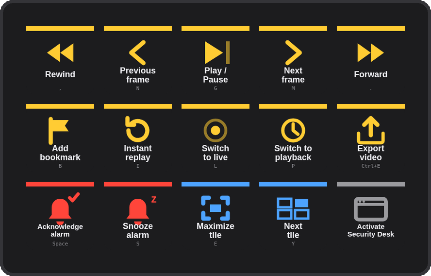
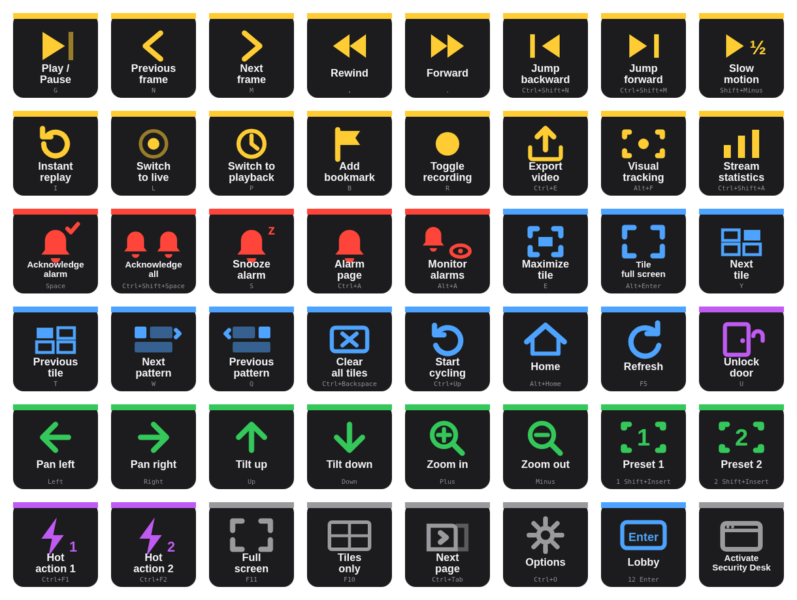
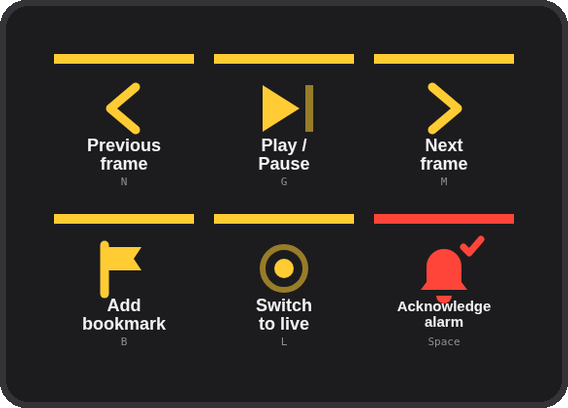
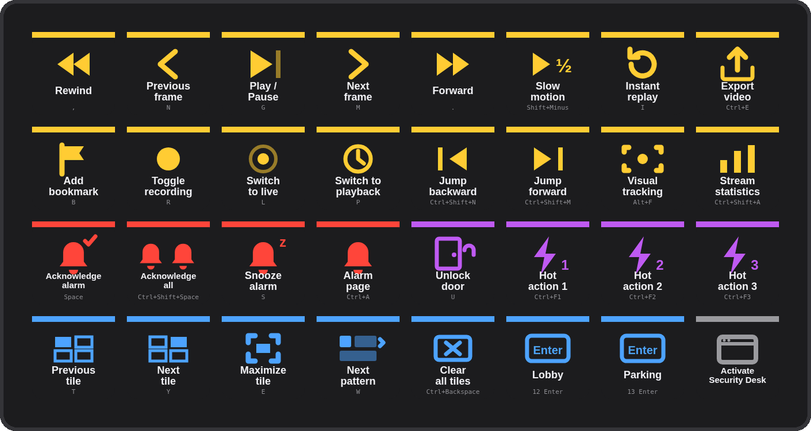

# Deck for Genetec Security Desk

A Stream Deck plugin for **Genetec Security Desk** (the Security Center operator client) — playback, alarms, tiles, PTZ, doors, hot actions and any camera by logical ID, on physical keys. Windows natively; on a Mac through Parallels, VMware Fusion or Microsoft Remote Desktop.

**[Website](https://kotyzap.github.io/Stream-Deck-Genetec-Plugin/) · [Download plugin](dist/com.4xsdev.genetec-sd-kofi.streamDeckPlugin)**

Two builds of the same plugin (same UUID, either updates the other): the GitHub download above adds a **Buy me a Ko-fi** key; the Elgato Marketplace build (`dist/com.4xsdev.genetec-sd.streamDeckPlugin`) leaves it out, as Marketplace guidelines forbid sponsor links inside plugins.



## Install

Download [`com.4xsdev.genetec-sd-kofi.streamDeckPlugin`](dist/com.4xsdev.genetec-sd-kofi.streamDeckPlugin) (or install from the Elgato Marketplace) and double-click it. Stream Deck adds the **Deck for Genetec Security Desk** action group and a ready-made profile for your device — **Security Desk** (15 keys), **Security Desk Mini** (3×2) or **Security Desk XL** (8×4).

Requirements: Stream Deck software 6.9+, Windows 10+ or macOS 12+, Security Desk (Security Center 5.x) — on a Mac inside Parallels, VMware Fusion or Microsoft Remote Desktop (the client itself is a Windows application). On macOS the Stream Deck app needs Accessibility permission to send keystrokes (it already has it if you use Elgato's Hotkey action).

## How it works

Security Desk ships with a documented set of default keyboard shortcuts (Options → Keyboard shortcuts). Every **Command** key sends one of them to the front window — so the bundled profiles work out of the box on a stock Security Desk. If your site customised the shortcuts, type yours into the key's **Hotkey** field. Every key prints the shortcut it sends.

Sequences are supported: `12 Enter` displays the entity with logical ID 12 in the selected tile, `3 Shift+Insert` goes to PTZ preset 3, `7 Ctrl+Enter` starts camera sequence 7. That's what the **Hotkey** key is for — give it a title ("Lobby"), a sequence (`12 Enter`) and a colour, and a Stream Deck XL becomes a camera wall selector.

## Actions



| Action | What it does |
|---|---|
| **Security Desk Command** | 69 documented shortcuts in seven groups — Camera (play/pause `G`, frame step `N`/`M`, rewind/forward `,`/`.`, jump `Ctrl+Shift+N`/`M`, slow motion, instant replay `I`, live `L` / playback `P`, bookmark `B`, record `R`, export `Ctrl+E`, visual tracking, statistics), Alarms (acknowledge `Space`, acknowledge all, snooze `S`, alarm page `Ctrl+A`, monitor alarms), Tiles (maximize `E`, full screen `Alt+Enter`, next/previous tile `Y`/`T`, patterns `W`/`Q`, clear all, back/forward/home, cycling, refresh `F5`), PTZ (arrows, `+`/`−`, presets 1–4), Doors (unlock `U`, unlock all), Hot actions 1–10 (`Ctrl+F1`–`F10`), General (full screen `F11`, tiles only `F10`, canvas/report `F9`, controls `F7`, selector `F6`, pages `Ctrl+Tab`, home page, saved tasks, options, auto lock, help). Shortcut editable per key. |
| **Security Desk Hotkey** | Any shortcut or sequence with your own title and colour — cameras and entities by logical ID, camera sequences, presets, anything you mapped yourself. |
| **Activate Security Desk** | Brings Security Desk to the front so the next shortcut lands in it. Windows: matches the window title (default "Security Desk"). Mac: activates the hosting app (default "Parallels Desktop"; set "VMware Fusion", "Windows App"…). |

Shortcut format: `Ctrl+Shift+F5`, parts of a sequence separated by spaces (`12 Enter`). Modifiers Ctrl / Alt / Shift; keys A–Z, 0–9, F1–F12, Space, Tab, Esc, Enter, Backspace, Delete, Insert, Home, End, PageUp, PageDown, arrows, Plus, Minus, Comma, Period, Grave.

## Profiles

| Mini | XL |
|---|---|
|  |  |

Generated by `profile/build_profile.py` (`LAYOUTS`); the plugin manifest binds each to its device type. The XL carries two **Hotkey** examples (Lobby = `12 Enter`, Parking = `13 Enter`) to rename to your own logical IDs.

## Under the hood

Stream Deck key → plugin (Node.js, Elgato SDK v2) → keystroke to the front window: Windows via PowerShell `SendKeys`, macOS via System Events (`osascript`) — the plugin picks the path from the OS it runs on. **Activate** uses `WScript.Shell.AppActivate` on Windows and `tell application … to activate` on macOS. No network, no Security Center SDK, no server-side footprint, nothing stored.

## Building

```bash
cd plugin && npm install && npm run build && cd ..     # bundle → plugin/com.4xsdev.genetec-sd.sdPlugin/bin/plugin.js
python3 profile/build_profile.py                      # three .streamDeckProfile files
cp profile/*.streamDeckProfile plugin/com.4xsdev.genetec-sd.sdPlugin/
node site/render.mjs                                  # key art + icons from the plugin's own SVGs (needs playwright)
python3 site/render_media.py                          # deck mockups, actions sheet, marketplace media (Pillow)
python3 site/build_site.py                            # docs/index.html
npx @elgato/cli validate plugin/com.4xsdev.genetec-sd.sdPlugin
bash plugin/package.sh                                 # → dist/com.4xsdev.genetec-sd.streamDeckPlugin (Marketplace)
bash plugin/package.sh --kofi                          # → dist/com.4xsdev.genetec-sd-kofi.streamDeckPlugin (GitHub)
```

## Limits

- Keystroke-based: Security Desk must be the front window (use **Activate** first, or chain it in a Multi Action), and the plugin cannot read state back (door status, alarm counts). For server-side actions without the client open you'd need a Security Center SDK integration — a different class of project.
- Shortcuts that act on the *selected* tile or entity do exactly that; select the tile first (`Y`/`T` keys or a click).
- The Mac path drives Security Desk inside Parallels / VMware / Remote Desktop, where ⌃ Control arrives as Ctrl.
- Written to Genetec's documented default shortcuts (Security Center 5.13) but **not yet tested against a running Security Desk** — reports welcome via [issues](https://github.com/kotyzap/Stream-Deck-Genetec-Plugin/issues).

## License

MIT — Pavel Kotyza · [4xs.dev](https://www.4xs.dev). Free and open source; if it saves you clicks, [buy me a Ko-fi](https://ko-fi.com/K3K6RR4LY). Independent project; not affiliated with Genetec Inc. or Elgato. Genetec and Security Center are trademarks of Genetec Inc.
